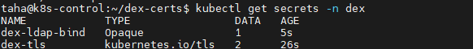
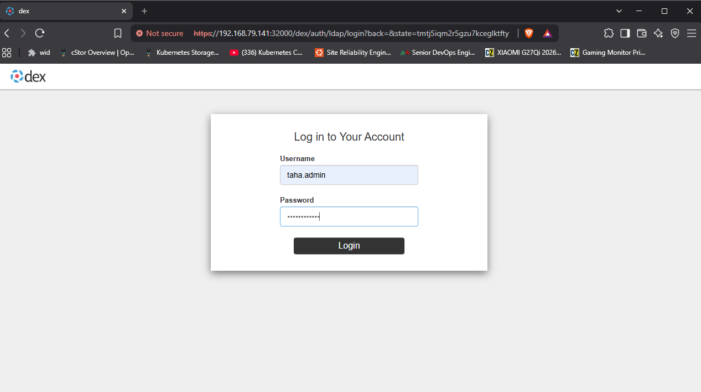
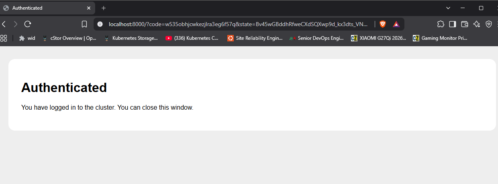

# Kubernetes Active Directory SSO

Log into a Kubernetes cluster using your existing Windows Active Directory account.

No separate cluster passwords and no shared kubeconfig files — you authenticate with your AD credentials, and what you're allowed to do is decided by the AD groups you already belong to.

Built and documented on a 4-node home lab (2 control planes, 2 workers) running Ubuntu 22.04, with Dex as the OIDC broker.

**Based on** the official Dex guide, [Integration kubelogin and Active Directory](https://dexidp.io/docs/guides/kubelogin-activedirectory/). That guide runs Dex as a standalone binary against a single API server with no RBAC. This project adapts it to run Dex inside Kubernetes, across two control planes, with AD group membership mapped to cluster permissions.

---

## Why this exists

Kubernetes can verify *who you are*, but it has nowhere to store users. Out of the box, teams end up passing around a copy of `/etc/kubernetes/admin.conf` — which means full cluster-admin for anyone holding the file, no record of who did what, and no way to revoke one person without reissuing certificates for everyone.

Most organisations already have every employee in Active Directory. This connects the two, so cluster access follows the accounts and groups that already exist.

| AD group | Kubernetes role | What they can do |
|---|---|---|
| `k8s-admins` | `cluster-admin` | Everything — create, delete, modify any resource in any namespace |
| `k8s-developers` | `view` | Read-only — list and describe resources, but no create, delete or modify |
| *(no group)* | none | Authenticates successfully, then can do nothing at all |

Access is then managed entirely in AD:

- **Granting access** — add the person to `k8s-developers`. Nothing changes on the cluster.
- **Promoting someone** — move them to `k8s-admins`. Takes effect on their next login.
- **Revoking access** — remove them from the group, or disable their AD account. Their token expires and no new one is issued.

And actions are attributed to the actual person rather than to a shared `kubernetes-admin` identity.

---

## How login works

| Step | What happens |
|---|---|
| 1 | You run a `kubectl` command |
| 2 | No valid token, so kubelogin opens a browser and sends you to Dex |
| 3 | Dex binds to AD as its **service account** and searches for your user |
| 4 | Dex binds again **as you**, using the password you typed — if AD accepts it, your password is correct |
| 5 | Dex reads your group memberships and issues a token containing them |
| 6 | The API server validates the token, and RBAC decides what you can do |

Dex is the translator in the middle: Kubernetes speaks OIDC, Active Directory speaks LDAP, Dex speaks both.

---

## What's running

| Component | Version | What it does |
|---|---|---|
| Kubernetes | v1.31.14 | Runs the containers |
| Ubuntu Server | 22.04.5 LTS | OS on all four nodes |
| containerd | 2.2.1 | Container runtime |
| Dex | v2.37.0 | Translates between Kubernetes and AD |
| Windows Server | 2019 | Domain controller for `lab.local` |
| Flannel | — | Pod networking |
| kubelogin | — | kubectl plugin that drives the browser login |

Dex runs from `ghcr.io/dexidp/dex:v2.37.0`, serves HTTPS on `0.0.0.0:5556`, and is exposed on NodePort `32000`. Storage uses the Kubernetes CRD backend, so Dex keeps its auth state in the cluster rather than on disk.

---

## Before you start

This assumes you already have a working Kubernetes cluster and a Windows Server domain controller.

The lab uses a single Active Directory domain, `lab.local`. Every command below uses `DC=lab,DC=local` as the base DN — substitute your own domain throughout.

**Steps 1–4 run on the domain controller** (PowerShell). **Everything from step 5 onwards runs on a control plane node** (bash).

| Placeholder | Meaning |
|---|---|
| `<DC-IP>` | The domain controller's address |
| `<CONTROL-PLANE-1-IP>` | First control plane node |
| `<CONTROL-PLANE-2-IP>` | Second control plane node |

---

## Setup

### 1. Create the AD groups

Two groups, so RBAC has something to differentiate between — one gets full access, the other read-only.

```powershell
New-ADGroup -Name "k8s-admins" -GroupScope Global -GroupCategory Security -Path "CN=Users,DC=lab,DC=local"
New-ADGroup -Name "k8s-developers" -GroupScope Global -GroupCategory Security -Path "CN=Users,DC=lab,DC=local"
```


### 2. Create the users

Two users, one per group. A single user only proves that login works; two prove that permissions actually differ.

`-EmailAddress` is required, not cosmetic. The API server is configured with `--oidc-username-claim=email`, so a user without a mail attribute has no username and authentication fails.

```powershell
New-ADUser -Name "Taha Admin" -SamAccountName "taha.admin" `
  -UserPrincipalName "taha.admin@lab.local" `
  -EmailAddress "taha.admin@lab.local" `
  -Path "CN=Users,DC=lab,DC=local" `
  -AccountPassword (Read-Host -AsSecureString "Password") -Enabled $true

New-ADUser -Name "Dev User" -SamAccountName "dev.user" `
  -UserPrincipalName "dev.user@lab.local" `
  -EmailAddress "dev.user@lab.local" `
  -Path "CN=Users,DC=lab,DC=local" `
  -AccountPassword (Read-Host -AsSecureString "Password") -Enabled $true
```


### 3. Assign group membership

```powershell
Add-ADGroupMember -Identity "k8s-admins" -Members "taha.admin"
Add-ADGroupMember -Identity "k8s-developers" -Members "dev.user"
```

Verify:

```powershell
Get-ADGroupMember -Identity "k8s-admins" | Select Name,SamAccountName
Get-ADGroupMember -Identity "k8s-developers" | Select Name,SamAccountName
```

### 4. Create the Dex service account

This account is different from the two above. It isn't a person, it never logs into the cluster, and it belongs to no groups.

**What it does.** Dex needs to look users up in Active Directory before it can authenticate them — find the account matching a given username, and read which groups that account belongs to. LDAP requires an authenticated connection to run those searches, so Dex needs credentials of its own. That's this account.

**What it does not do.** It does not authenticate anyone. When a user logs in, two separate LDAP binds happen:

1. Dex binds as `dex-service` and searches for the user
2. Dex binds again *as that user*, using the password they just typed — if AD accepts it, the password is correct

So the service account is a **directory reader**, not an authenticator. The user's password is verified by AD itself, and Dex never stores it.

This is why it needs no privileges beyond directory reads. The upstream Dex guide binds as `cn=Administrator`, which hands full domain rights to a component that only needs to run searches. A dedicated account means that if the Dex config leaks, the credential exposed can read the directory and nothing else.

```powershell
New-ADUser -Name "Dex Service" -SamAccountName "dex-service" `
  -UserPrincipalName "dex-service@lab.local" `
  -Path "CN=Users,DC=lab,DC=local" `
  -AccountPassword (Read-Host -AsSecureString "Password") `
  -Enabled $true -PasswordNeverExpires $true -CannotChangePassword $true
```

`-PasswordNeverExpires` and `-CannotChangePassword` are deliberate: this is a non-interactive account, and an expired password would silently break every cluster login at once. No group membership is added — authenticated domain users can read the directory by default, which is all Dex requires.


### 5. Verify the service account can read the directory

Run this from a **control plane node**, not the domain controller. It proves the account works from where Dex will actually use it.

```bash
sudo apt install -y ldap-utils

ldapsearch -x -H ldap://<DC-IP>:389 \
  -D "CN=Dex Service,CN=Users,DC=lab,DC=local" \
  -W \
  -b "CN=Users,DC=lab,DC=local" \
  "(sAMAccountName=taha.admin)" dn mail memberOf
```

`-W` prompts for the **`dex-service` password** — the one set in step 4, not the domain administrator's.

Expected output:

```
dn: CN=Taha Admin,CN=Users,DC=lab,DC=local
memberOf: CN=k8s-admins,CN=Users,DC=lab,DC=local
mail: taha.admin@lab.local
```

Three things are confirmed here, and all three go straight into the Dex config: the service account binds successfully, `mail` is populated (the API server uses it as the username), and `memberOf` returns the group DN that RBAC will match on.


### 6. Point `dex.lab.local` at a node

Dex is exposed as a NodePort service on port 32000, which means the port is open on *every* node in the cluster — traffic to any of them reaches the Dex pod wherever it happens to be scheduled. So `dex.lab.local` just needs to resolve to one node consistently.

**Consistently is the important word.** The API server resolves this name to call Dex's OIDC discovery endpoint, and it does so on every control plane. If they resolve it differently — or if the name has multiple entries and round-robins — authentication succeeds or fails depending on which API server the request lands on, with no obvious pattern.

I pointed it at the first control plane: it's the node least likely to be powered off in a lab, and it keeps the entry point on the machine I work from. Any node would function.

Add the entry on **both control planes**, since the API server is what resolves the name:

```bash
# On both control plane nodes
echo "<CONTROL-PLANE-1-IP>  dex.lab.local" | sudo tee -a /etc/hosts
```

Check for existing entries first — a stale line from an earlier build will silently take precedence, or add a second address and give you round-robin resolution:

```bash
grep dex.lab.local /etc/hosts
```

Verify on each node. This must return exactly one address, identical on both:

```bash
getent hosts dex.lab.local
```

Use `getent`, not `nslookup` — `nslookup` queries DNS directly and skips `/etc/hosts`, so it can report a different answer than the system actually uses.

Worker nodes don't need the entry, since nothing on them resolves this name. Any machine running `kubectl` does, because kubelogin opens `https://dex.lab.local:32000` in a browser.

### 7. Generate the Dex certificate

Dex serves HTTPS, so it needs a certificate before it will start.

The OpenSSL config and command below are taken from the [upstream Dex guide](https://dexidp.io/docs/guides/kubelogin-activedirectory/), with two changes explained underneath.

A certificate is an ID card that says "I am `dex.lab.local`." When something connects, TLS checks whether the name it typed matches a name on the card. The `[alt_names]` section is that list of names.

```bash
mkdir -p ~/dex-certs && cd ~/dex-certs

cat > req.cnf <<'EOF'
[req]
req_extensions = v3_req
distinguished_name = req_distinguished_name

[req_distinguished_name]

[ v3_req ]
basicConstraints = CA:FALSE
keyUsage = nonRepudiation, digitalSignature, keyEncipherment
subjectAltName = @alt_names

[alt_names]
DNS.1 = dex.lab.local
IP.1 = <CONTROL-PLANE-1-IP>
EOF

openssl req -new -x509 -sha256 -days 3650 -newkey rsa:4096 \
  -extensions v3_req -out tls.crt -keyout tls.key \
  -config req.cnf -subj "/CN=dex.lab.local" -nodes
```

**Change 1 — added the node's IP as a second name.** The guide lists the hostname alone, which is all normal operation needs: the API server and kubelogin both connect via `dex.lab.local`. The IP is for debugging. If login breaks, you need to know whether the *name* is the problem or *Dex* is the problem — and hitting the IP directly skips name resolution entirely. Without the IP on the certificate, that test fails on a name mismatch regardless of whether Dex is healthy.

**Change 2 — renamed the output files.** The guide produces `openid-ca.pem` and `openid-key.pem`; these are `tls.crt` and `tls.key` because `kubectl create secret tls` expects those names. The guide runs Dex as a standalone binary and never creates a Kubernetes secret, so it doesn't matter there.

`-days 3650` gives a ten-year certificate, so a silent expiry doesn't break every cluster login a year from now.

### 8. Verify the certificate

If the `-extensions v3_req` flag doesn't apply cleanly, OpenSSL still produces a perfectly valid-looking certificate — just with no alternative names on it. Nothing fails at this point; the problem surfaces several steps later as an x509 error from the API server, which looks like a Dex problem and isn't.

```bash
openssl x509 -in tls.crt -noout -text | grep -A2 "Subject Alternative Name"
```

Expected output:

```
X509v3 Subject Alternative Name:
    DNS:dex.lab.local, IP Address:<CONTROL-PLANE-1-IP>
```

Both names must be listed. If the section is empty or absent, regenerate the certificate — the config file wasn't picked up.


### 9. Copy the certificate to both control planes

The API server has to verify Dex's certificate when it calls the OIDC discovery endpoint. Dex's certificate is self-signed, so nothing trusts it by default — the API server needs to be handed the certificate explicitly and told to trust it via `--oidc-ca-file` in step 15.

```bash
# On the first control plane
sudo cp ~/dex-certs/tls.crt /etc/kubernetes/pki/dex-ca.crt

# Copy to the second control plane
scp ~/dex-certs/tls.crt <user>@<CONTROL-PLANE-2-IP>:/tmp/dex-ca.crt
ssh <user>@<CONTROL-PLANE-2-IP> "sudo cp /tmp/dex-ca.crt /etc/kubernetes/pki/dex-ca.crt && sudo chmod 644 /etc/kubernetes/pki/dex-ca.crt && rm /tmp/dex-ca.crt"
```

**`/etc/kubernetes/pki` specifically.** kubeadm already mounts that directory into the API server container, so a certificate placed there is visible to the process. The upstream guide uses `/etc/ssl/certs/openid-ca.pem`, which is not mounted — that path only works when the API server runs directly on the host, which is what the guide assumes.

**Only the certificate is copied, never `tls.key`.** The API server verifies Dex's identity; it never presents that identity. The private key stays put and goes into a Kubernetes secret in the next step.

**Both control planes, without exception.** If only one node has the file, authentication succeeds or fails depending on which API server the request reaches — which looks intermittent rather than broken, and is much harder to diagnose than a clean failure.

Verify on both:

```bash
sudo md5sum /etc/kubernetes/pki/dex-ca.crt
```

The hashes must match.

### 10. Create the namespace and secrets

Dex needs two secrets to exist before it starts. It mounts both, and a missing one leaves the pod stuck in `ContainerCreating`.

```bash
kubectl create namespace dex
```

**TLS secret** — the certificate and key Dex serves HTTPS with:

```bash
kubectl create secret tls dex-tls \
  --cert=$HOME/dex-certs/tls.crt \
  --key=$HOME/dex-certs/tls.key \
  -n dex
```

**LDAP bind password** — for the `dex-service` account from step 4:

```bash
kubectl create secret generic dex-ldap-bind \
  --from-literal=bindPW='<dex-service password>' \
  -n dex
```

Use single quotes, or bash will mangle any `!`, `$`, or `&` in the password.

The password goes in a Secret rather than in the Dex config file so the config can be committed to this repo as-is. The upstream guide puts it straight in the config, which is fine for a local demo but not for anything in git.

Verify:

```bash
kubectl get secrets -n dex
```

```
NAME             TYPE                DATA   AGE
dex-ldap-bind    Opaque              1      10s
dex-tls          kubernetes.io/tls   2      30s
```

`dex-tls` should be type `kubernetes.io/tls` with 2 keys. If it says `Opaque`, it was created with the wrong command.



### 11. Create the Dex config

This tells Dex where Active Directory is, how to find a user, and how to find which groups they're in.

Save as `manifests/dex/configmap.yaml`:

```yaml
apiVersion: v1
kind: ConfigMap
metadata:
  name: dex-config
  namespace: dex
data:
  config.yaml: |
    # Dex's own address. Must be identical to --oidc-issuer-url on the
    # API server, or the API server won't trust the tokens Dex issues.
    issuer: https://dex.lab.local:32000/dex

    # Where Dex saves login sessions. "kubernetes" = store them in the
    # cluster, so Dex keeps nothing on disk and can restart safely.
    storage:
      type: kubernetes
      config:
        inCluster: true

    # Dex serves HTTPS. These files come from the dex-tls secret,
    # mounted at /etc/dex/tls by the Deployment in step 13.
    web:
      https: 0.0.0.0:5556
      tlsCert: /etc/dex/tls/tls.crt
      tlsKey: /etc/dex/tls/tls.key

    oauth2:
      # Skip the "allow this app?" page. One less click.
      skipApprovalScreen: true

    # Which app is allowed to ask Dex for a login. Here, that's kubectl.
    staticClients:
    - id: kubernetes
      name: Kubernetes
      secret: ZXhhbXBsZS1hcHAtc2VjcmV0
      # After login, Dex sends the browser back here. kubelogin is
      # listening on one of these ports on your own machine.
      redirectURIs:
      - http://localhost:8000
      - http://localhost:18000

    connectors:
    - type: ldap
      id: ldap
      name: Active Directory
      config:
        host: <DC-IP>:389
        insecureNoSSL: true    # plain LDAP, not LDAPS

        # The account Dex logs in as to search the directory.
        # The password comes from the dex-ldap-bind secret created in
        # step 10, via an environment variable — not from this file.
        bindDN: CN=Dex Service,CN=Users,DC=lab,DC=local
        bindPW: $LDAP_BIND_PW

        # Finding the person logging in.
        userSearch:
          baseDN: CN=Users,DC=lab,DC=local   # where to look
          filter: "(objectClass=user)"       # only look at users
          username: sAMAccountName           # what they type to log in
          idAttr: distinguishedName          # their unique id
          emailAttr: mail                    # becomes their k8s username
          nameAttr: cn                       # their display name

        # Finding their groups.
        groupSearch:
          baseDN: CN=Users,DC=lab,DC=local
          filter: "(objectClass=group)"      # only look at groups
          # Match a group if its member list contains this user.
          userMatchers:
          - userAttr: distinguishedName
            groupAttr: member
          nameAttr: cn                       # token says "k8s-admins",
                                             # not the full long DN
```

```bash
kubectl apply -f manifests/dex/configmap.yaml
```

**What is that `secret` under staticClients?**

It's a shared password between Dex and kubectl — not an AD password, and nothing to do with users.

Dex only issues tokens to applications it recognises. `staticClients` is that list, and it has one entry: kubectl. When kubectl exchanges its login code for a token, it sends this string to prove it's the app Dex expects rather than something else pointed at the same endpoint. The value here must match the `--oidc-client-secret` kubectl is configured with in step 18.

`ZXhhbXBsZS1hcHAtc2VjcmV0` is the placeholder from the upstream guide (base64 of "example-app-secret"). Since it only has to match on both sides, any string works — a real deployment would generate a random one.

**Two other things worth knowing.**

`emailAttr: mail` is why step 2 insisted on setting `-EmailAddress`. The API server uses `--oidc-username-claim=email`, so this attribute *is* the Kubernetes username. No email, no login.

`groupSearch` matches on `member`, not `memberOf`. The `ldapsearch` in step 5 showed `memberOf` on the user — but Dex works from the other end, looking for groups whose member list contains the user. Same relationship, opposite direction. Getting it backwards gives you logins that succeed with no groups attached, which then looks like an RBAC problem.

### 12. Give Dex permission to manage its own storage

Step 11 set `storage: type: kubernetes`, which means Dex keeps login sessions and tokens in the cluster as custom resources rather than in a database. To do that it has to create those resource types and read and write them — so it needs a ServiceAccount with permissions of its own.

**This has nothing to do with user access.** It's Dex's own housekeeping. Mapping AD groups to cluster permissions is a separate step (16), and the two are easy to confuse because both involve ClusterRoles.

Save as `manifests/dex/rbac.yaml`:

```yaml
# The identity the Dex pod runs as.
apiVersion: v1
kind: ServiceAccount
metadata:
  name: dex
  namespace: dex
---
# What that identity is allowed to do.
apiVersion: rbac.authorization.k8s.io/v1
kind: ClusterRole
metadata:
  name: dex
rules:
# Full access to Dex's own custom resources — where it stores auth
# codes, refresh tokens and sessions.
- apiGroups: ["dex.coreos.com"]
  resources: ["*"]
  verbs: ["*"]
# Permission to create those resource types in the first place.
# Dex registers them itself on first start.
- apiGroups: ["apiextensions.k8s.io"]
  resources: ["customresourcedefinitions"]
  verbs: ["create"]
---
# Tie the two together.
apiVersion: rbac.authorization.k8s.io/v1
kind: ClusterRoleBinding
metadata:
  name: dex
roleRef:
  apiGroup: rbac.authorization.k8s.io
  kind: ClusterRole
  name: dex
subjects:
- kind: ServiceAccount
  name: dex
  namespace: dex
```

Apply it **before** the Deployment. Without it the pod starts, tries to register its CRDs, gets refused, and crash-loops with a permissions error that looks like a config problem:

```bash
kubectl apply -f manifests/dex/rbac.yaml
```

Dex creates the CRDs when it first starts, in the next step. Confirm afterwards:

```bash
kubectl get crd | grep dex.coreos.com
```

> **Note for teardown:** these CRDs are cluster-scoped, so deleting the `dex` namespace leaves them behind, along with this ClusterRole and ClusterRoleBinding. A clean removal needs all three deleted explicitly.

### 13. Deploy Dex

This is where everything created so far gets wired together: the config from step 11, the two secrets from step 10, and the ServiceAccount from step 12.

Save as `manifests/dex/deployment.yaml`:

```yaml
apiVersion: apps/v1
kind: Deployment
metadata:
  name: dex
  namespace: dex
  labels:
    app: dex
spec:
  replicas: 1
  selector:
    matchLabels:
      app: dex
  template:
    metadata:
      labels:
        app: dex
    spec:
      # The identity from step 12, so Dex can manage its own CRDs.
      serviceAccountName: dex
      containers:
      - name: dex
        image: ghcr.io/dexidp/dex:v2.37.0
        # Point Dex at the config file mounted below.
        command: ["/usr/local/bin/dex", "serve", "/etc/dex/cfg/config.yaml"]
        ports:
        - name: https
          containerPort: 5556
        env:
        # This is what $LDAP_BIND_PW in the config expands to.
        # Dex reads it from the environment at startup, so the
        # password never appears in the ConfigMap.
        - name: LDAP_BIND_PW
          valueFrom:
            secretKeyRef:
              name: dex-ldap-bind
              key: bindPW
        volumeMounts:
        # config.yaml lands at /etc/dex/cfg/config.yaml
        - name: config
          mountPath: /etc/dex/cfg
        # tls.crt and tls.key land in /etc/dex/tls/
        - name: tls
          mountPath: /etc/dex/tls
      volumes:
      - name: config
        configMap:
          name: dex-config
      - name: tls
        secret:
          secretName: dex-tls
```

```bash
kubectl apply -f manifests/dex/deployment.yaml
kubectl get pods -n dex -w
```

**How the file paths work.** Nothing is built into the image — the config and certificate are mounted in at runtime. A ConfigMap or Secret is a set of key-value pairs, and mounting one as a volume turns each key into a file. The `dex-tls` secret has keys `tls.crt` and `tls.key`, so mounting it at `/etc/dex/tls` produces `/etc/dex/tls/tls.crt` and `/etc/dex/tls/tls.key` — exactly the paths written in the config in step 11. Change a `mountPath` here and the config has to change to match, or Dex exits with "no such file or directory".

**Check the logs, not just the pod status.** A Running pod only means the container started; the LDAP connection is made lazily and problems show up here:

```bash
kubectl logs -n dex deploy/dex
```

A healthy start looks roughly like:

```
level=info msg="config using log level: info"
level=info msg="config issuer: https://dex.lab.local:32000/dex"
level=info msg="config storage: kubernetes"
level=info msg="config connector: ldap"
level=info msg="listening (https) on 0.0.0.0:5556"
```

The `config connector: ldap` line confirms the connector loaded. If the bind credentials are wrong, the error appears here rather than at deploy time.

> **Config changes need a pod delete, not a restart.** A mounted ConfigMap is read once when the container starts, so editing it has no effect on a running pod:
>
> ```bash
> kubectl delete pod -l app=dex -n dex
> ```

### 14. Expose Dex outside the cluster

Dex is listening on port 5556 inside the pod, which nothing outside the cluster can reach. A NodePort service opens a fixed port on every node and forwards it to the pod.

Save as `manifests/dex/service.yaml`:

```yaml
apiVersion: v1
kind: Service
metadata:
  name: dex
  namespace: dex
spec:
  type: NodePort
  selector:
    app: dex          # send traffic to pods with this label
  ports:
  - name: https
    port: 5556        # the service's own port
    targetPort: 5556  # the port Dex listens on in the pod
    nodePort: 32000   # the port opened on every node
```

```bash
kubectl apply -f manifests/dex/service.yaml
kubectl get svc -n dex
```

**Why the node port is pinned to 32000.** Left unset, Kubernetes assigns a random port from the NodePort range — and that port is part of the issuer URL (`https://dex.lab.local:32000/dex`), which is baked into the Dex config, the API server flags, and every kubeconfig. A changing port would break all of them every time the Service was recreated.

This also explains why the pod's location doesn't matter. NodePort opens 32000 on *every* node, so traffic to any of them reaches the Dex pod wherever it happens to be scheduled. `dex.lab.local` only has to resolve to a node, not to the right one.

**Test the whole chain.** This is the first point where everything can be verified end to end:

```bash
curl --cacert ~/dex-certs/tls.crt \
  https://dex.lab.local:32000/dex/.well-known/openid-configuration
```

Expected — a JSON document starting with:

```json
{
  "issuer": "https://dex.lab.local:32000/dex",
  "authorization_endpoint": "https://dex.lab.local:32000/dex/auth",
  "token_endpoint": "https://dex.lab.local:32000/dex/token",
  ...
  "scopes_supported": ["openid", "email", "groups", "profile", "offline_access"]
}
```

One request confirms four things at once: `dex.lab.local` resolves, the NodePort routes, the pod is serving, and the certificate validates against the hostname. It's also exactly the request the API server makes in the next step, so if this works, OIDC discovery will work.

Check that `scopes_supported` includes `groups` — that's the scope carrying AD group membership into the token.

> Using `curl -k` here would skip verification entirely and prove only that Dex is responding. `--cacert` is the meaningful test, because it checks the certificate the same way the API server will.

### 15. Point the API server at Dex

Kubernetes doesn't know Dex exists yet. These flags tell the API server to accept tokens issued by it.

The five flags come from the [upstream Dex guide](https://dexidp.io/docs/guides/kubelogin-activedirectory/), with the CA path changed to `/etc/kubernetes/pki/dex-ca.crt` for the reason given in step 9.

Edit the manifest on the **first control plane**:

```bash
sudo nano /etc/kubernetes/manifests/kube-apiserver.yaml
```

Add these under `spec.containers[0].command`, alongside the other flags:

```yaml
    # Where to fetch Dex's signing keys. Must match the "issuer" in
    # the discovery JSON exactly — no trailing slash.
    - --oidc-issuer-url=https://dex.lab.local:32000/dex
    # Only accept tokens issued for this client.
    - --oidc-client-id=kubernetes
    # Dex's certificate is self-signed, so the API server has to be
    # told to trust it. This is the file copied in step 9.
    - --oidc-ca-file=/etc/kubernetes/pki/dex-ca.crt
    # Which claim in the token becomes the Kubernetes username.
    - --oidc-username-claim=email
    # Which claim carries group membership, for RBAC to match on.
    - --oidc-groups-claim=groups
```

Indentation must line up with the existing flags, or the API server won't start.

Save. The kubelet notices the manifest changed and recreates the API server pod on its own. Wait about 30 seconds, then:

```bash
kubectl get nodes
```

**Only once that returns healthy, repeat on the second control plane.** One node at a time — breaking both API servers simultaneously means losing the cluster, and the admin context can't help if there's no API server left to talk to.

**Both control planes need identical flags.** The upstream guide says "restart API server(s)" and moves on, without mentioning that every control plane needs the same flags and the same certificate file. If only one has them, the other API server has no idea Dex exists, and authentication succeeds or fails depending on which one the request reaches.

Verify on each node:

```bash
sudo grep -c oidc /etc/kubernetes/manifests/kube-apiserver.yaml   # expect 5
sudo md5sum /etc/kubernetes/pki/dex-ca.crt                        # must match
getent hosts dex.lab.local                                        # must resolve
```

### 16. Map AD groups to cluster permissions

At this point a user can log in, but they can't do anything. Authentication and authorisation are separate: Dex proves who you are, RBAC decides what you're allowed to do. Nothing has told Kubernetes what an AD group means yet.

**Do this before switching kubectl over.** Cut across to the OIDC user first and you authenticate successfully as someone with zero permissions — including no permission to create the bindings that would fix it. The upstream guide never mentions RBAC at all.

Save as `manifests/rbac/ad-groups.yaml`:

```yaml
# Anyone in the k8s-admins AD group gets full cluster access.
apiVersion: rbac.authorization.k8s.io/v1
kind: ClusterRoleBinding
metadata:
  name: ad-k8s-admins
roleRef:
  apiGroup: rbac.authorization.k8s.io
  kind: ClusterRole
  name: cluster-admin        # built-in role, nothing to define
subjects:
- kind: Group                # matches a group claim in the token,
  name: k8s-admins           # not a Kubernetes object
  apiGroup: rbac.authorization.k8s.io
---
# Anyone in k8s-developers gets read-only access.
apiVersion: rbac.authorization.k8s.io/v1
kind: ClusterRoleBinding
metadata:
  name: ad-k8s-developers
roleRef:
  apiGroup: rbac.authorization.k8s.io
  kind: ClusterRole
  name: view                 # built-in read-only role
subjects:
- kind: Group
  name: k8s-developers
  apiGroup: rbac.authorization.k8s.io
```

```bash
kubectl apply -f manifests/rbac/ad-groups.yaml
kubectl get clusterrolebinding | grep ad-k8s
```

**Why the short name and not the full DN.** `kind: Group` here matches a string in the token's `groups` claim — there's no Kubernetes object called `k8s-admins`, and RBAC never talks to Active Directory. The token carries `k8s-admins` rather than `CN=k8s-admins,CN=Users,DC=lab,DC=local` because the Dex config sets `nameAttr: cn` under `groupSearch` (step 11). Drop that setting and the token carries the full DN, these bindings match nothing, and users authenticate fine with no permissions.

### 17. Install kubelogin

kubectl can't perform a browser login on its own. **kubelogin** is a plugin that handles the OIDC flow — it opens the browser, receives the token, and caches it so you're not logging in on every command.

```bash
cd /tmp
curl -LO https://github.com/int128/kubelogin/releases/latest/download/kubelogin_linux_amd64.zip
unzip kubelogin_linux_amd64.zip
sudo install -m 755 kubelogin /usr/local/bin/kubectl-oidc_login
```

**The filename matters.** kubectl finds plugins by looking for an executable named after the subcommand, so `kubectl oidc-login` requires a binary called `kubectl-oidc_login` — hyphen in the command, **underscore** in the filename. Installing it as `kubelogin` alone leaves it working standalone but invisible to kubectl, which then fails with `unknown command "oidc-login"`.

If you already have the binary, a symlink is enough:

```bash
sudo ln -s $(which kubelogin) /usr/local/bin/kubectl-oidc_login
```

Verify:

```bash
kubectl oidc-login --version
```

### 18. Configure kubectl and log in

Add an `oidc` user that calls kubelogin whenever kubectl needs credentials:

```bash
kubectl config set-credentials oidc \
  --exec-api-version=client.authentication.k8s.io/v1beta1 \
  --exec-command=kubectl \
  --exec-arg=oidc-login \
  --exec-arg=get-token \
  --exec-arg=--oidc-issuer-url=https://dex.lab.local:32000/dex \
  --exec-arg=--oidc-client-id=kubernetes \
  --exec-arg=--oidc-client-secret=ZXhhbXBsZS1hcHAtc2VjcmV0 \
  --exec-arg=--oidc-extra-scope=profile \
  --exec-arg=--oidc-extra-scope=email \
  --exec-arg=--oidc-extra-scope=groups \
  --exec-arg=--certificate-authority=$HOME/dex-certs/tls.crt
```

`--oidc-client-secret` must be byte-identical to the `secret` in the `staticClients` block from step 11. `--certificate-authority` points at Dex's certificate so kubectl can verify it, the same way the API server does.

**Test without switching context.** `--user=oidc` uses the OIDC identity for a single command while leaving the admin context intact, so a misconfiguration costs a failed command rather than access to the cluster:

```bash
kubectl --user=oidc get nodes
```

A browser window opens on the Dex login page. Log in as `taha.admin@lab.local` with the AD password.

> Run this from a machine with a desktop. Over a plain SSH session there's no display for the browser to open on, and kubelogin fails with `could not open the browser`.





#### Verify the identity and groups

```bash
kubectl --user=oidc auth whoami
```

Expected:

```
ATTRIBUTE   VALUE
Username    taha.admin@lab.local
Groups      [k8s-admins system:authenticated]
```

This is the check that matters. The username confirms `emailAttr: mail` fed through to `--oidc-username-claim=email`, and `k8s-admins` confirms the LDAP group search worked and the claim reached RBAC. A username with no groups means `groupSearch` is misconfigured — see step 11 on `member` versus `memberOf`.

#### Prove the two groups actually differ

One user proves login works. Two prove the permissions model works:

```bash
# as taha.admin (k8s-admins)
kubectl --user=oidc auth can-i delete pods --all-namespaces
# yes

# switch users — clear the cached token first
rm -rf ~/.kube/cache/oidc-login

# log in as dev.user (k8s-developers)
kubectl --user=oidc get pods -A             # works, read-only
kubectl --user=oidc auth can-i delete pods  # no
```

Same cluster, same login flow, different access — determined entirely by Active Directory group membership.

> **Clear the token cache when switching users.** kubelogin caches tokens in `~/.kube/cache/oidc-login`, so without clearing it the second login silently reuses the first user's token and appears to ignore the credentials typed in. Dex also keeps a browser session cookie, so a private window helps.

### 19. Create a context so OIDC is the default

Passing `--user=oidc` on every command gets old fast, and it's easy to forget — at which point kubectl silently falls back to the admin certificate and you're testing nothing. A context makes the OIDC identity the default.

A context is just a named pairing of a cluster, a user, and a namespace.

```bash
kubectl config get-clusters    # confirm the cluster name first

kubectl config set-context oidc-context \
  --cluster=kubernetes \
  --user=oidc

kubectl config use-context oidc-context
```

Now plain commands use the AD login:

```bash
kubectl get nodes
kubectl auth whoami
```

`auth whoami` is worth running whenever something behaves unexpectedly — `current-context` shows what's selected, `auth whoami` shows who the API server actually resolved you as.

#### Keep the admin context

**Do not delete `kubernetes-admin@kubernetes`.** It authenticates with a client certificate and belongs to `system:masters`, which bypasses RBAC entirely — so it keeps working when Dex is down, the API server flags are wrong, or the RBAC bindings are broken. It's the way back in, and it should be treated like a root password.

```bash
kubectl config get-contexts
```

```
CURRENT   NAME                          CLUSTER      AUTHINFO
*         oidc-context                  kubernetes   oidc
          kubernetes-admin@kubernetes   kubernetes   kubernetes-admin
```

Switching back:

```bash
kubectl config use-context kubernetes-admin@kubernetes
```

## License

MIT — see [LICENSE](LICENSE).
