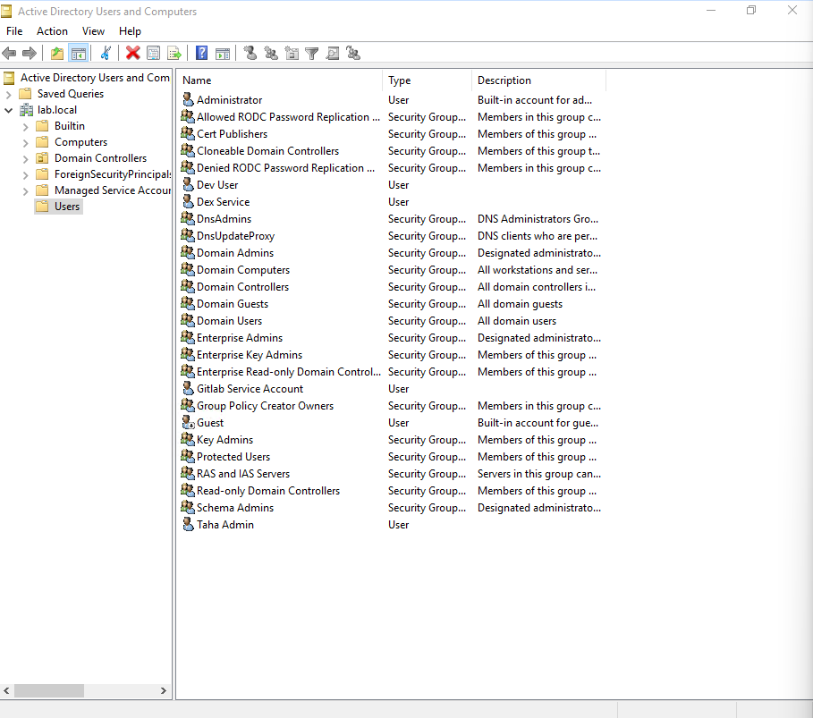
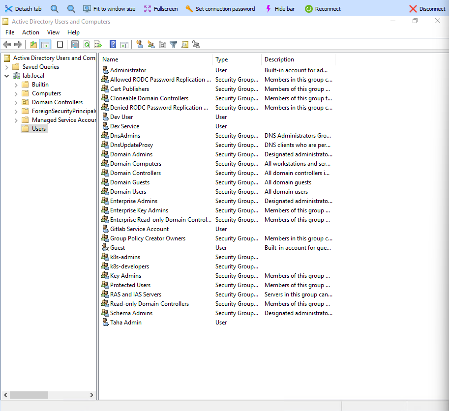
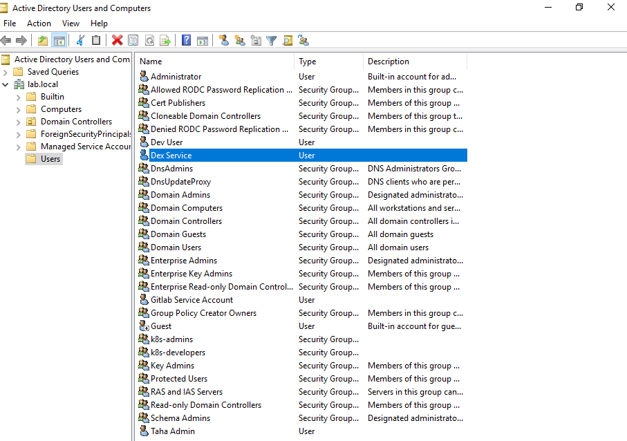
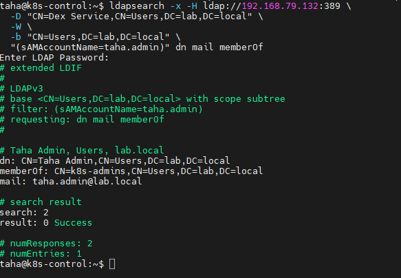
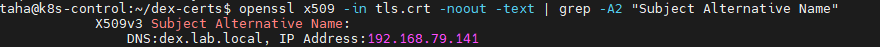

# Kubernetes-Active-Directory-SSO
Kubernetes cluster where kubectl authenticates once against Windows Active Directory using Dex as an OIDC broker. Built and documented on a 4-node (2 control planes and 2 workers) Ubuntu 22.04 home lab.

This setup assumes that you already have a working Kubernetes Cluster. 

###
The lab uses a single Active Directory domain (Windows Server 2019), `lab.local`, running on a
Windows Server VM. Every command below uses `DC=lab,DC=local` as the base DN —
substitute your own domain throughout.

### 1. Create the two AD Groups to verify RBAC

```powershell
New-ADGroup -Name "k8s-admins" -GroupScope Global -GroupCategory Security -Path "CN=Users,DC=lab,DC=local"
New-ADGroup -Name "k8s-developers" -GroupScope Global -GroupCategory Security -Path "CN=Users,DC=lab,DC=local"
```

### 2. Create the users

`-EmailAddress` is required, not cosmetic. The API server is configured with
`--oidc-username-claim=email`, so a user without a mail attribute has no
username and authentication fails.

```powershell
New-ADUser -Name "Taha Admin" -SamAccountName "taha.admin" `
  -UserPrincipalName "taha.admin@lab.local" `
  -EmailAddress "taha.admin@lab.local" `
  -Path "CN=Users,DC=lab,DC=local" `
  -AccountPassword (Read-Host -AsSecureString "Password") -Enabled $true

New-ADUser -Name "Dev User" -SamAccountName "dev.user" `
  -UserPrincipalName "dev.user@lab.local" `
  -EmailAddress "dev.user@lab.local" `
  -Path "CN=Users,DC=lab,DC=local" `
  -AccountPassword (Read-Host -AsSecureString "Password") -Enabled $true
```


### 3. Create the groups and assign group membership

```powershell
New-ADGroup -Name "k8s-admins" -GroupScope Global -GroupCategory Security -Path "CN=Users,DC=lab,DC=local"
New-ADGroup -Name "k8s-developers" -GroupScope Global -GroupCategory Security -Path "CN=Users,DC=lab,DC=local"
```

```powershell
Add-ADGroupMember -Identity "k8s-admins" -Members "taha.admin"
Add-ADGroupMember -Identity "k8s-developers" -Members "dev.user"
```

Verify:

```powershell
Get-ADGroupMember -Identity "k8s-admins" | Select Name,SamAccountName
Get-ADGroupMember -Identity "k8s-developers" | Select Name,SamAccountName
```



### 4. Create the Dex service account

This account is different from the two above. It isn't a person, it never logs
into the cluster, and it belongs to no groups.

**What it does.** Dex needs to look users up in Active Directory before it can
authenticate them — find the account matching a given username, and read which
groups that account belongs to. LDAP requires an authenticated connection to
run those searches, so Dex needs credentials of its own. That's this account.

**What it does not do.** It does not authenticate anyone. When a user logs in,
two separate LDAP binds happen:

1. Dex binds as `dex-service` and searches for the user
2. Dex binds again *as that user*, using the password they just typed —
   if AD accepts it, the password is correct

So the service account is a **directory reader**, not an authenticator. The
user's password is verified by AD itself, and Dex never stores it.

This is why it needs no privileges beyond directory reads. The upstream Dex
guide binds as `cn=Administrator`, which hands full domain rights to a
component that only needs to run searches. A dedicated account means that if
the Dex config leaks, the credential exposed can read the directory and
nothing else.

```powershell
New-ADUser -Name "Dex Service" -SamAccountName "dex-service" `
  -UserPrincipalName "dex-service@lab.local" `
  -Path "CN=Users,DC=lab,DC=local" `
  -AccountPassword (Read-Host -AsSecureString "Password") `
  -Enabled $true -PasswordNeverExpires $true -CannotChangePassword $true
```

`-PasswordNeverExpires` and `-CannotChangePassword` are deliberate: this is a
non-interactive account, and an expired password would silently break every
cluster login at once. No group membership is added — authenticated domain
users can read the directory by default, which is all Dex requires.



### 5. Verify the service account can read the directory

Run this from your Kubernetes Control Plane Server, not the domain controller. It proves the account
works from where Dex will actually use it.

You will be prompted for the administrator password of the domain controller. 

```bash
ldapsearch -x -H ldap://<YOUR_IP>:389 \
  -D "CN=Dex Service,CN=Users,DC=lab,DC=local" \
  -W \
  -b "CN=Users,DC=lab,DC=local" \
  "(sAMAccountName=taha.admin)" dn mail memberOf
```

Expected output:

```
dn: CN=Taha Admin,CN=Users,DC=lab,DC=local
mail: taha.admin@lab.local
memberOf: CN=k8s-admins,CN=Users,DC=lab,DC=local
```


### 6. Point `dex.lab.local` at a node

Dex is exposed as a NodePort service on port 32000, which means the port is
open on *every* node in the cluster — traffic to any of them reaches the Dex
pod wherever it happens to be scheduled. So `dex.lab.local` just needs to
resolve to one node consistently.

**Consistently is the important word.** The API server resolves this name to
call Dex's OIDC discovery endpoint, and it does so on both control planes. If
they resolve it differently — or if the name has multiple A records and
round-robins — authentication succeeds or fails depending on which API server
the request lands on, with no obvious pattern.

I pointed it at my first control plane node: a control plane is the node
least likely to be powered off in a lab, and it keeps the entry point on the
machine I work from. Any node would function.

Add the entry on **all the control planes** — they're the hosts that must have
it, since the API server is what resolves the name:

```bash
# On <CONTROL-PLANE-NODE-1> AND <CONTROL-PLANE-NODE-2>
echo "<CONTROL-PLANE-NODE-1-IP>  dex.lab.local" | sudo tee -a /etc/hosts
```

Verify on each node. This must return exactly one address, identical on both:

```bash
getent hosts dex.lab.local
```

```
<CONTROL-PLANE-NODE-1-IP>  dex.lab.local
```

### 7. Generate the Dex certificate

Dex serves HTTPS, so it needs a certificate before it will start.

The OpenSSL config and command below are taken from the
[upstream Dex guide](https://dexidp.io/docs/guides/kubelogin-activedirectory/),
with two changes explained underneath.

A certificate is an ID card that says "I am `dex.lab.local`." When something
connects, TLS checks whether the name it typed matches a name on the card. The
`[alt_names]` section is that list of names.

**Change 1 — added the node's IP as a second name. This is primarily for debugging purposes** 
The guide lists the hostname alone... 

When login breaks, you need to know whether the name is the problem or Dex is the problem. Hitting the IP directly skips name resolution entirely — if that works, the name is broken; if it doesn't, Dex is broken.

```bash
cat > req.cnf <<'EOF'
[req]
req_extensions = v3_req
distinguished_name = req_distinguished_name

[req_distinguished_name]

[ v3_req ]
basicConstraints = CA:FALSE
keyUsage = nonRepudiation, digitalSignature, keyEncipherment
subjectAltName = @alt_names

[alt_names]
DNS.1 = dex.lab.local
IP.1 = <CONTROL-PLANE-NODE-1-IP>
EOF

openssl req -new -x509 -sha256 -days 3650 -newkey rsa:4096 \
  -extensions v3_req -out tls.crt -keyout tls.key \
  -config req.cnf -subj "/CN=dex.lab.local" -nodes
```

Check before moving on:

```bash
openssl x509 -in tls.crt -noout -text | grep -A2 "Subject Alternative Name"
```

Expected output:

```
X509v3 Subject Alternative Name:
    DNS:dex.lab.local, IP Address:192.168.79.141
```
Both names must be listed (dex.lab.local and your ***CONTROL-PLANE-NODE-1-IP***. 
If the section is empty or absent, regenerate the certificate — the config file wasn't picked up.



### 9. Copy the certificate to both control planes

Ensure that you copy the certificate to /etc/kubernetes/pki/***name-of-certificate.crt***

The API server has to verify Dex's certificate when it calls the OIDC
discovery endpoint. Dex's certificate is self-signed, so nothing trusts it by
default — the API server needs to be handed the certificate explicitly and
told to trust it via `--oidc-ca-file`.


